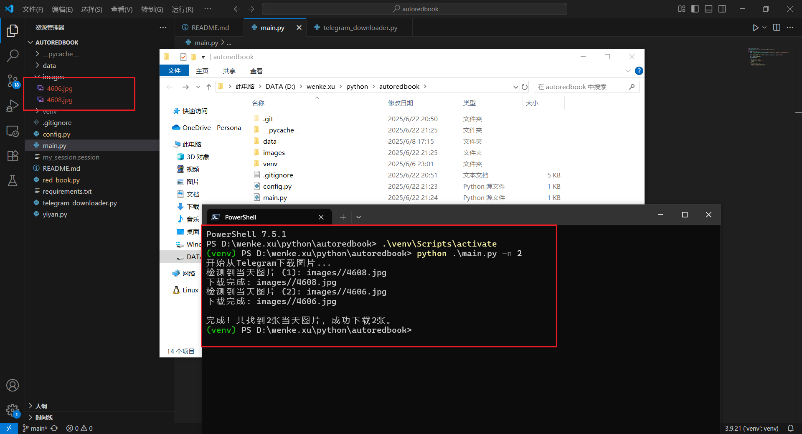

# autoredbook

实现每天从telegram爬取图片，然后自动化发布到小红书

* [X]  自动登录小红书
* [X]  自动上传图文到小红书
* [X]  从telegram下载图片

# 使用方法

下载代码：

```shell
git clone https://github.com/XuWink/autoredbook.git
cd autoredbook
python -m venv venv
.\venv\Scripts\activate
pip install requirements.txt
```

修改配置：

需要配置一些小红书，telegram等的信息，在config.py中

第一次使用，小红书需要使用手机号登录，按照提示输入验证码即可，登录成功后会将cookies存储到cookies.pkl中，之后就不用再登录了；

还有就是需要申请自己的telegram app_id和api_hash，网上查一下教程即可，不过可能在申请过程中因为网络问题出现错误，这个需要找一个干净的IP。我是找了一个马来西亚的网友帮忙申请的。

使用：

```shell
# 上传图片到小红书
python main.py -n 1

# 从telegram中下载图片
python main.py -n 2
```



https://github.com/user-attachments/assets/cd6ecd3d-cd3e-43ee-bd52-f81839ca6b9e
